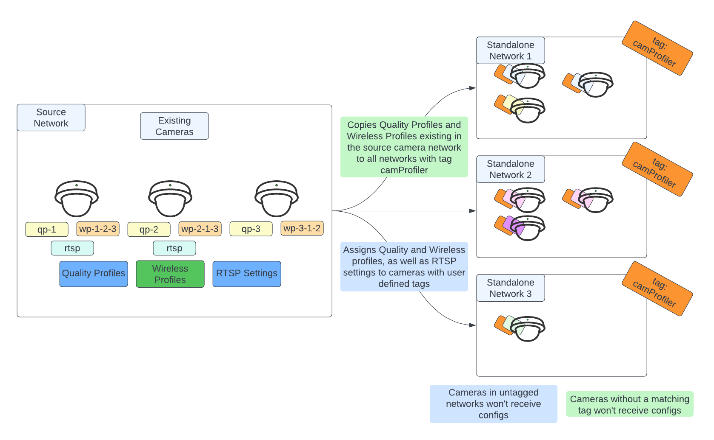
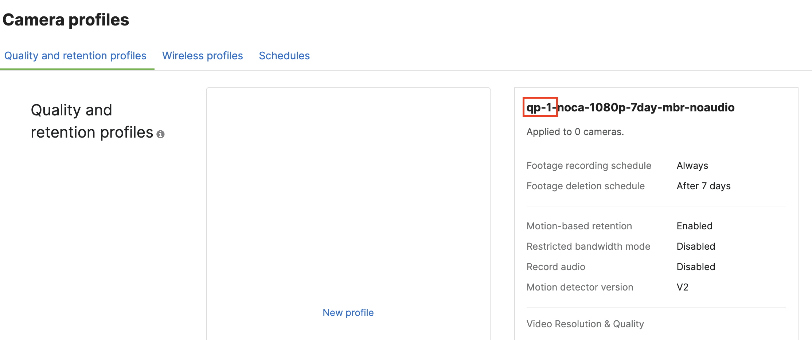
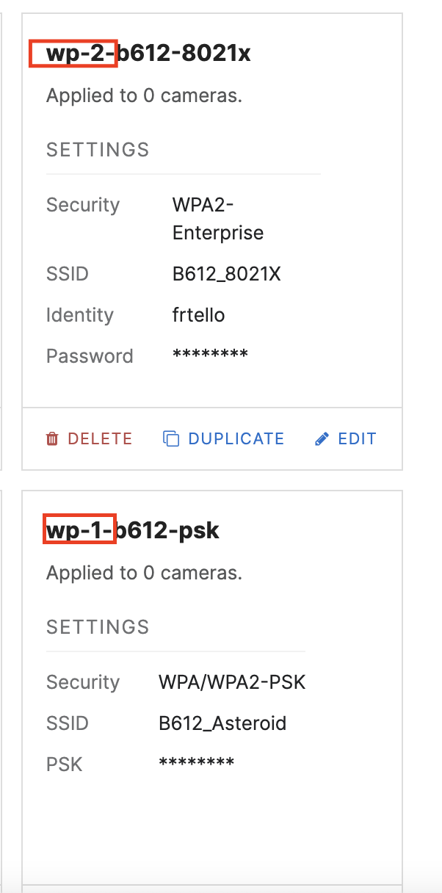
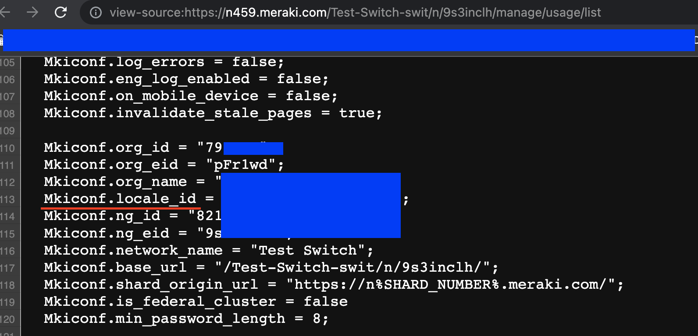
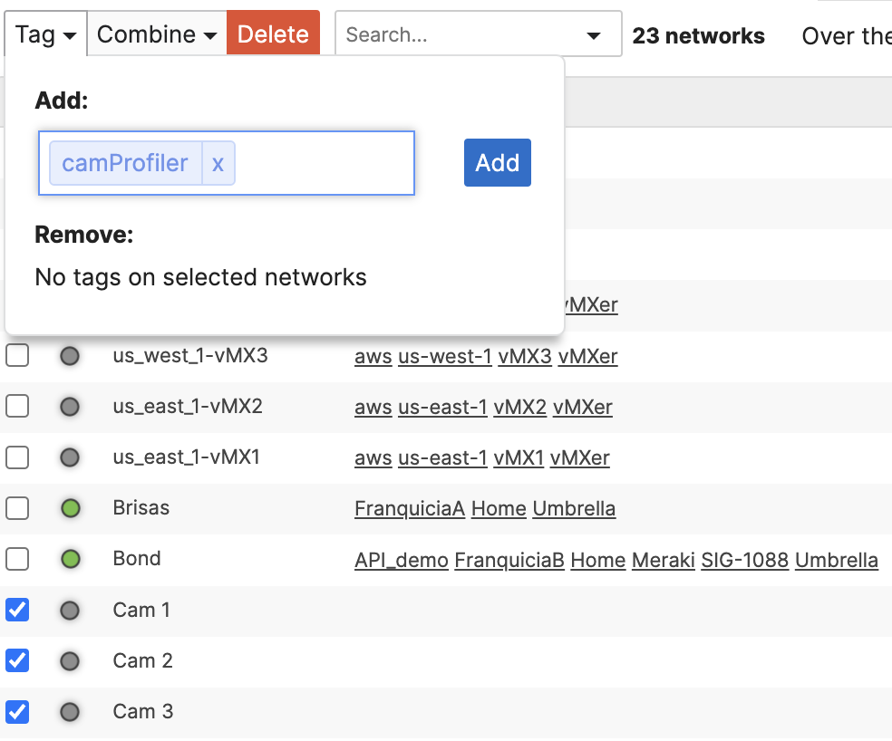
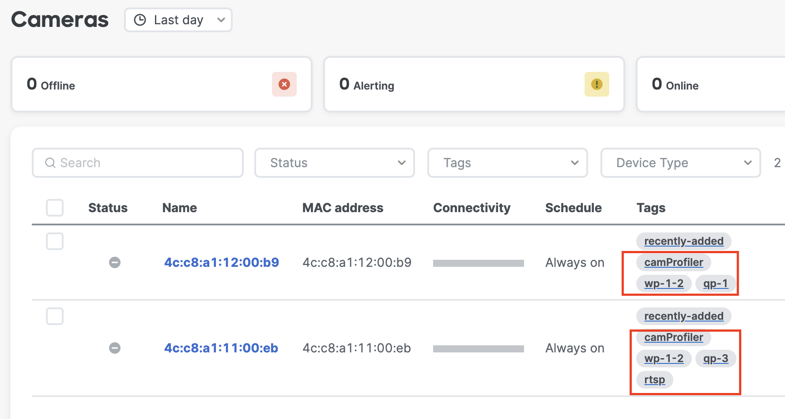

# merakiCamProfiler
Copy and assign camera quality and wireless profiles, as well as mass-enable RTSP from a source template network, giving you faster and more consistent deployments.

# Table of Contents

[Introduction](#intro)

[Prerequisites](#prereq)

[How to use](#howtouse)

[Caveats](#caveats)

# Introduction

Cisco Meraki MV cameras bring many benefits to organizations looking to deploy a video surveillance and analytics solution with ease, scalability and future-proofing. As customer deployments grow, it can be helpful to leverage programmability capabilities in the platform to further automate rollout and config management at scale, reducing the possibility of human error. 

This tool simplifies the process of assigning quality, wireless and RSTP settings to camera deployments in one or multiple organizations, by leveraging user-defined tags:
* **Network Tags** identify networks the tool will operate on and copy Quality and Wireless Profiles configurations to, from a source network that already has them defined
* **Camera Tags** identify cameras within these networks that will have their quality profiles and wireless profiles assigned following these user defined tags, as well as enabling RTSP settings on the camera

The script has the added flexibility of allowing you to reference a network template as a source that resides in a different organization than the one where your target cameras currently exist on, permitting syncing configurations across organizations.

All of this is done without ever binding cameras to configuration templates, which allows you to keep completely separate firmware upgrade procedures across networks.

## Prerequisites

1. Active Cisco Meraki subscriptions in the orgs where the script will be run
2. API access enabled for these organizations, as well as an API Key with access to them. See how to enable [here](https://documentation.meraki.com/General_Administration/Other_Topics/Cisco_Meraki_Dashboard_API)
3. A working Python 3.0 environment
4. Install libraries in `requirements.txt`
5. Create a network that will function as a template (Not an actual template!) for housing your configurations (this can optionally be a production network as well).
6. Set up quality and wireless profiles for each of the types of cameras you will deploy in your environment in the source template. You can see how to configure [quality](https://documentation.meraki.com/MV/Initial_Configuration/Bulk_Configuring_Quality_and_Retention_Settings_Through_Profiles) and [wireless](https://documentation.meraki.com/MV/Initial_Configuration/MV_Wireless_Configuration_Guide) profiles in the provided links. Make sure each Quality profile you create has a naming scheme that follows `qp-X-description` where `X` is a unique number, and `description` is a string that helps you identify the purpose of the profile, but that does not contain any additional `-` dashes to the ones encasing X. Make sure each Wireless profile you create has a naming scheme that follows `wp-X-description` where `X` is a unique number, and `description` is a string that helps you identify the purpose of the profile, but that does not contain any additional `-` dashes to the ones encasing X.

7. Make sure that your destination networks match the same firmware major version as the source network (for example, if your source network is on MV5+, your target networks should also be MV5+).
8. Deploy additional standalone networks with cameras in them

## How to Use

1. Clone repo to your working directory with `git clone https://github.com/Francisco-1088/merakiCamProfiler.git`
2. Edit `config.py`
* Add your API Key under `api_key` in line 2
* Add the Organization ID of the organization where the source network exists. You can find your Org ID easily by right clicking anywhere in the screen while logged in to your organization, and clicking "View Page Source". In the resulting page use "Find" to look for the keyword `Mkiconf.org_id`

* Add the Organization ID of the organization where your target standalone camera networks exist. These networks may be combined networks, and may reside in the same organization as the source template, but don't have to. You can find this organization ID in the same way outlined in the previous step.
* Add the Source Network ID for the network storing all of the camera profiles created in Prerequisites #5. You can find this ID easily by navigating to your Source Network in the Meraki Dashboard, right-clicking anywhere and choosing "View Page Source". In the resulting page use "Find" to look for the keyword `Mkiconf.locale_id`. Copy the number between the quotation marks, and prepend the string `L_` right before it, and add it to the configuration file under `src_net_id`. For example, if your template's ID is `34567897`, the value you should input in the configuration file is `L_34567897`.

* OPTIONAL: Modify the tag under `dst_network_tag` to a tag of your preference. You may use `camProfiler` if you want. This tag is used to identify networks that your script will deploy configurations to.
* OPTIONAL: Modify the tag under `dst_camera_tag` to a tag of your preference. You may use `camProfiler` if you want. This tag is used to identify cameras that your script will deploy camera configurations to.
* OPTIONAL: Modify the tag under `rtsp_enable_tag` to a tag of your preference. You may use `rtsp` if you want. This tag identifies cameras that will have RTSP enabled on them by the script.
* OPTIONAL: Modify verbosity and logging settings. By default, the script will show you every step it's going through, and will prompt you before making any configuration changes. It is recommended to use it this way while you're testing the script, and for debugging purposes. `verbose` displays additional information about the data gathered from the source networks. `supervised` prompts you before every configuration change, allowing you to skip it. `console_logging` enables API log messages to appear in the console. You may set any of these to `False` if you do not want this level of logging.
3. Run `pip install -r requirements.txt` from your terminal
4. [Tag networks](https://documentation.meraki.com/General_Administration/Organizations_and_Networks/Organization_Menu/Manage_Tags) you want to work on with the same tag you defined in `config.py` under `dst_network_tag`

5. [Tag cameras](https://documentation.meraki.com/General_Administration/Organizations_and_Networks/Organization_Menu/Manage_Tags#Creating_Device_tags) you want to copy quality and wireless profiles to with the same tag you defined in `config.py` under `dst_camera_tag`
6. Tag some of these same cameras with one additonal tag that has the same `qp-X` prefix that your desired quality profile for this camera has. For example, if your source network has a quality profile named `qp-1-highdef`, any cameras you want with this quality profile should carry the `qp-1` tag.
7. Tag some these same cameras with one additonal tag that has the `wp-X-Y-Z` format, where X, Y and Z are integers that identify a wireless profile number and their priority order, and where -Z is optional, but -X-Y are mandatory. For example, if you have 3 wireless profiles `wp-1-psk`, `wp-2-eap`, `wp-3-psk2`, and a camera that needs to use `wp-2-eap` as primary, `wp-1-psk` as secondary and `wp-3-psk`, then this tag should have `wp-2-1-3`.

The tagged cameras in the picture will receive the configurations of the quality profiles prefixed with `qp-1` and `qp-3`. For camera `4c:c8:a1:12:00:b9`, the assigned wireless profiles will be `wp-1` and `wp-2`, in that order. For camera `4c:c8:a1:11:00:eb`, the assigned wireless profiles will be `wp-1` and `wp-2` in that order. 

NOTE: Quality Profiles and Wireless Profiles have the following restrictions:
* Assigning a camera without a CA license a profile that has CA enabled will fail
* A camera MUST ONLY have a single tag with the format `qp-X`
* A camera MUST ONLY have a single tag with the format `wp-X-Y` or `wp-X-Y-Z`. The tag MUST reference at least two wireless profiles, and optionally a third, but never more than 3, so `wp-1-2` and `wp-2-3-1` are acceptable tags, but not `wp-1-3-4-2`
* Quality profile and Wireless profile tags are optional, and only cameras with the `camProfiler` tag will be considered, so even if a camera has a `qp-X` or `wp-X-Y-Z` tag, but doesn't have the `camProfiler` tag, that camera will not be operated on

8. Tag some these same cameras with your chosen `rtsp_enabled_tag` (`rtsp` by default). These cameras will have RTSP turned on for them by the script.

9. Run the script with `python main.py`

**Note:** If using the `supervised=True` configuration in the `config.py` file, every time the script will apply configuration changes it will prompt you to accept whether you want to continue or not. The prompt ONLY accepts `Y` for continuing, or `N` for skipping, and it is cap-sensitive. Any other input will break execution. A `N` will return execution to the script before calling the function with the exception of Quality Profiles and Wireless Profiles. If you choose to skip either of these, the script will also break execution, as not creating these will cause problems when attempting to update Camera configurations.

## Caveats

1. This script is intended to help managing large amounts of camera wireless profiles, quality profiles and RTSP settings
2. The script does not copy any other camera settings today
3. For better results, your source network should be on the same major firmware version as your target networks, otherwise some settings may not be successfully copied due to compatibility issues
4. Be advised that changing Wireless Profile configuration may have connectivity implications for your targeted cameras, especially if they are Wireless-only cameras
5. Be advised that changing Quality Profiles configuration may have temporary impact on video recording, especially when assigning no-record profiles
6. Start small, and test the script with a small number of networks and cameras, and progressively increase the number of sites until you get a feel for the time it takes for the script to gather data and push configs. Remember the Meraki API has a 10 requests per second per organization limit. Every network you want to push changes to will generate at least 10 GET API calls to gather data about the network, so if you're working on 500 networks this means 5000 API calls, which take at least 8 minutes and 20 seconds to complete, and likely a bit longer, plus the amount of time it will take to push configuration changes which will be longer. As such, it's a good idea to segment your work in groups of networks and not try to get everything done at the same time.
